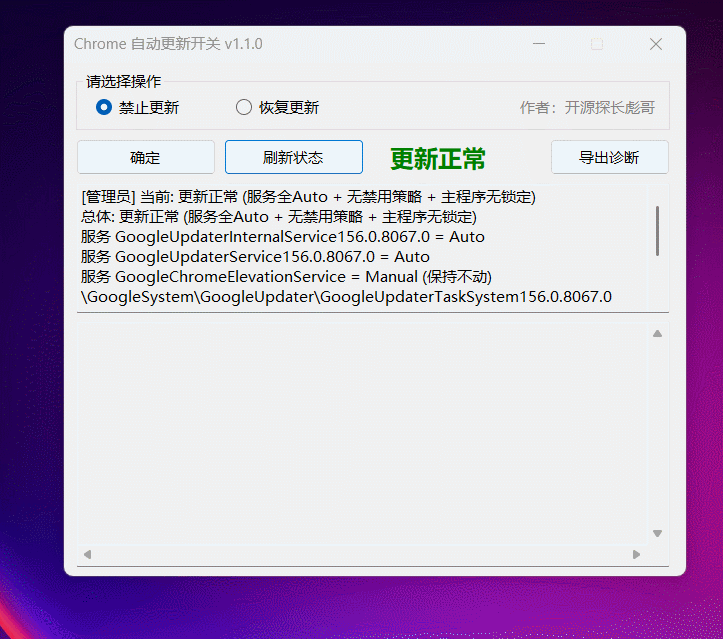

<div align="center">
  <h1>🐢 ChromeUpdateToggle</h1>
  <p><em>一个开关，管住 Chrome 自动更新。</em></p>
</div>
<p align="center">
  <a href="README.md"></a>
  <a href="README_EN.md"></a>
  <a href="LICENSE"></a>
  
  
  
</p>
<p align="center"></p>

Chrome 一年更新 50 多个版本，右上角天天催，偶尔还把线上项目的 API 炸了。这个工具只做一件事：禁止时一次掐断更新链，恢复时按基线精确还原。

## 为什么选它？

- **三处齐掐才拦得住**：只禁服务没用，156 的更新器服务停了也能被 COM 拉起。工具同时掐服务、注册表策略、主程序文件锁。
- **恢复不是瞎恢复**：禁止前先给机器拍基线快照，恢复时照单还原，而不是一刀切回默认值。
- **先告诉你现在啥状态**：红（已禁止）/绿（正常）/橙（不一致）大字显示，不用猜。
- **中英双语**：界面下拉一切换，诊断包跟着变英文，发给老外也能用。
- **出问题能定位**：每次运行落盘日志，一键导出诊断包（状态 + 基线 + 日志 + 版本）。

## 对比表

| 功能 | ChromeUpdateToggle | BAT 脚本 | 手动三件套 | 企业策略模板 |
|------|:---:|:---:|:---:|:---:|
| 一键禁止/恢复 | ✅ | ✅ | ❌ | ❌ |
| 基线快照 + 精确还原 | ✅ | ❌ | ❌ | ❌ |
| 当前状态显示 | ✅ | ❌ | ❌ | ❌ |
| 中英双语界面 | ✅ | ❌ | ❌ | ❌ |
| 诊断包导出 | ✅ | ❌ | ❌ | ❌ |
| 单文件 EXE | ✅ | ❌ | ❌ | ❌ |
| 免费 | ✅ | ✅ | ✅ | ✅ |

BAT 脚本指本项目前身的 `chrome-update-toggle.bat`，能干活但栽在括号路径、重定向歧义、`for` 通配符三个解析坑里。

手动三件套指 `services.msc` + 任务计划 + 注册表手改，步骤散、没基线、回滚靠记忆。

企业策略模板指 Google 官方 ADMX（含 `UpdateDefault` 等），免费但要自己配 GPO/注册表，无界面、无基线、无状态。

## 安装 / 快速开始

两个版本二选一，都是单个 EXE：

- **1.7MB 版**（本机自用）：`bin/Release/fx/publish/ChromeUpdateToggle.exe`，需要装 .NET 8 Desktop 运行时。
- **154MB 版**（发给别人）：`bin/Release/net8.0-windows/win-x64/publish/ChromeUpdateToggle.exe`，自带运行库，没装 .NET 也能跑。

```bash
# 自己打包
dotnet publish -c Release                                  # 自包含单文件
dotnet publish -c Release --no-self-contained -o bin/Release/fx/publish
```

双击即弹 UAC（要管理员），不用右键。

## 使用

<p align="center"></p>

界面：单选「禁止更新 / 恢复更新」，点「确定」。右上角大字看状态，下面是明细和日志。

```text
ChromeUpdateToggle.exe            # 打开界面（默认中文，下拉可切 English）
ChromeUpdateToggle.exe --disable  # 禁止更新，exit 0 成功
ChromeUpdateToggle.exe --enable   # 按最新基线恢复
ChromeUpdateToggle.exe --reset    # 回出厂默认（服务Auto/任务启用/删策略键/解锁）
ChromeUpdateToggle.exe --status   # 只读查状态
ChromeUpdateToggle.exe --lang en|zh  # 切换语言
ChromeUpdateToggle.exe --export-diagnostics [zip路径]  # 导出诊断包，默认放桌面
```

`--status` 实测输出长这样：

```text
更新正常 (服务全Auto + 无禁用策略 + 主程序无锁定)
总体: 更新正常 (服务全Auto + 无禁用策略 + 主程序无锁定)
服务 GoogleUpdaterInternalService156.0.8067.0 = Auto
服务 GoogleUpdaterService156.0.8067.0 = Auto
服务 GoogleChromeElevationService = Manual (保持不动)
任务 (无Google更新类任务)
注册表 UpdateDefault = (无策略键)
updater.exe DENY=False | GoogleUpdate.exe DENY=False
```

## 工作原理

Chrome 156 的更新器是纯服务 + COM 拉起模式，服务停了照样每天 `ForceInstall`。所以三处都得掐：

- **服务**：只禁 2 个 Updater 自动服务。服务发现是双保险，服务名命中模式**且**可执行路径含 `Google`，第三方撞名也误伤不了（反向测试验证过）。`ElevationService` 全程不动。
- **注册表**：官方 kill-switch，`HKLM\SOFTWARE\Policies\Google\Update` 下 `UpdateDefault=0` 等 4 个 DWORD，COM 拉起也认。
- **文件锁**：给更新主程序加 DENY（执行+写）。exe 从系统服务的 `BinaryPath` 反推定位，换盘/换路径跟得上；无服务的 legacy 残留保留硬编码兜底。

禁止前先写 `baseline\<时间>-disable\baseline.json`（服务 StartMode、任务状态、注册表值、文件列表），恢复时照读。另有 21 项回归测试（`test-csharp.ps1`）+ 假服务反向测试（`test-fake-service.ps1`）+ 诊断包测试（`test-diag.ps1`）。

## 贡献与开发

欢迎提 Issue 和 PR。开发环境：.NET 8 SDK + Windows 10/11，`dotnet build` 即编。改完跑一遍 `test-csharp.ps1`（要管理员）再提交。

## 支持

我养了两只猫，汤圆和饺子。如果你觉得 ChromeUpdateToggle 给你的生活带来了快乐，你可以喂它们 [罐头食品 🥩](https://ko-fi.com/gokuscraper)。

## License

见 [LICENSE](LICENSE)（Apache 2.0）。

---

*Keywords: Chrome 禁止更新, 关闭Chrome自动更新, UpdateDefault, GoogleUpdater, 单文件EXE, WinForms, 中英双语, chrome disable updates, chrome update toggle, windows service, baseline restore, bilingual*
