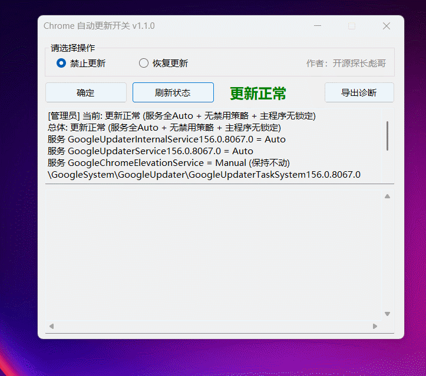

<div align="center">
  <h1>🐢 ChromeUpdateToggle</h1>
  <p><em>One switch to tame Chrome auto-updates.</em></p>
</div>
<p align="center">
  <a href="README.md"></a>
  <a href="README_EN.md"></a>
  <a href="LICENSE"></a>
  
  
  
</p>
<p align="center"></p>

Chrome ships 50+ releases a year, nags you from the corner, and occasionally breaks your production APIs. This tool does one thing: cut the whole update chain when disabling, restore exactly from a baseline when re-enabling.

## Why This One?

- **Three cuts, or it doesn't stick**: disabling services alone won't stop updater 156 — a stopped service still gets COM-activated for a daily `ForceInstall`. The tool cuts services, registry policy, and the updater binaries together.
- **Restore means restore**: it snapshots a baseline before disabling and restores from it, instead of blindly resetting to defaults.
- **See the state first**: big red (disabled) / green (normal) / orange (inconsistent) indicator, no guessing.
- **Bilingual**: switch between 中文 and English from a dropdown, diagnostics bundle follows along.
- **Debuggable**: every run logs to disk, one click exports a diagnostics bundle (state + baseline + logs + version).

## 📸 Screenshots



## Comparison

| Feature | ChromeUpdateToggle | BAT script | Manual trio | Enterprise policy templates |
|------|:---:|:---:|:---:|:---:|
| One-click disable/restore | ✅ | ✅ | ❌ | ❌ |
| Baseline snapshot + exact restore | ✅ | ❌ | ❌ | ❌ |
| Current-state display | ✅ | ❌ | ❌ | ❌ |
| Bilingual UI | ✅ | ❌ | ❌ | ❌ |
| Diagnostics export | ✅ | ❌ | ❌ | ❌ |
| Single-file EXE | ✅ | ❌ | ❌ | ❌ |
| Free | ✅ | ✅ | ✅ | ✅ |

BAT script refers to this project's predecessor `chrome-update-toggle.bat`. It worked but kept tripping over paren paths, redirect ambiguity, and `for`-wildcard quirks.

Manual trio means `services.msc` + Task Scheduler + hand-edited registry: scattered steps, no baseline, rollback from memory.

Enterprise policy templates means Google's official ADMX (including `UpdateDefault`): free but DIY GPO/registry, no UI, no baseline, no state.

## Install / Quick Start

Pick one, both are single EXE:

- **1.7MB build** (for yourself): `bin/Release/fx/publish/ChromeUpdateToggle.exe`, needs the .NET 8 Desktop runtime.
- **154MB build** (for sharing): `bin/Release/net8.0-windows/win-x64/publish/ChromeUpdateToggle.exe`, self-contained, runs without .NET installed.

```bash
# Build it yourself
dotnet publish -c Release                                  # self-contained single file
dotnet publish -c Release --no-self-contained -o bin/Release/fx/publish
```

Double-click prompts UAC right away (admin required), no right-click needed.

## Usage

UI: pick 「Disable updates / Restore updates」, hit OK. The big indicator shows the state, details and logs below.

```text
ChromeUpdateToggle.exe            # Open UI (Chinese by default, switch to English from dropdown)
ChromeUpdateToggle.exe --disable  # Disable updates, exit 0 on success
ChromeUpdateToggle.exe --enable   # Restore from newest baseline
ChromeUpdateToggle.exe --reset    # Factory defaults (services Auto / tasks enabled / policy key deleted / unlocked)
ChromeUpdateToggle.exe --status   # Read-only state check
ChromeUpdateToggle.exe --lang en|zh  # Switch language
ChromeUpdateToggle.exe --export-diagnostics [zip path]  # Export diagnostics bundle, Desktop by default
```

Real `--status` output:

```text
Updates NORMAL (services all Auto + no blocking policy + exes unlocked)
Overall: Updates NORMAL (services all Auto + no blocking policy + exes unlocked)
Service GoogleUpdaterInternalService156.0.8067.0 = Auto
Service GoogleUpdaterService156.0.8067.0 = Auto
Service GoogleChromeElevationService = Manual (untouched)
Tasks (no Google updater tasks)
Registry UpdateDefault = (no policy key)
updater.exe DENY=False | GoogleUpdate.exe DENY=False
```

## How It Works

Chrome 156's updater is services + COM activation: stopped services still `ForceInstall` daily. So all three must be cut:

- **Services**: only the 2 auto-start Updater services. Discovery is double-gated — the name must match the pattern **and** the binary path must contain `Google`, so third-party name collisions can't cause damage (verified by a negative test). `ElevationService` is never touched.
- **Registry**: the official kill-switch, 4 DWORDs including `UpdateDefault=0` under `HKLM\SOFTWARE\Policies\Google\Update`, honored even by COM-activated runs.
- **File lock**: DENY (execute+write) on the updater binaries. Locations are derived from the services' `BinaryPath`, so drive/path changes are covered; the legacy leftover with no service keeps a hardcoded fallback.

Before disabling it writes `baseline\<time>-disable\baseline.json` (service start modes, task states, registry values, file list) and restores from it. Covered by a 21-case regression suite (`test-csharp.ps1`), a fake-service negative test (`test-fake-service.ps1`), and a diagnostics test (`test-diag.ps1`).

## Contributing

Issues and PRs welcome. Dev environment: .NET 8 SDK + Windows 10/11, just `dotnet build`. Run `test-csharp.ps1` (needs admin) before committing.

## Support

I have two cats, Tangyuan and Jiaozi. If ChromeUpdateToggle brings joy to your life, you can feed them [canned food 🥩](https://ko-fi.com/gokuscraper).

## License

See [LICENSE](LICENSE) (Apache 2.0).

---

*Keywords: Chrome disable updates, chrome update toggle, UpdateDefault, GoogleUpdater, single-file EXE, WinForms, bilingual, Chrome 禁止更新, 基线还原, 中英双语*
